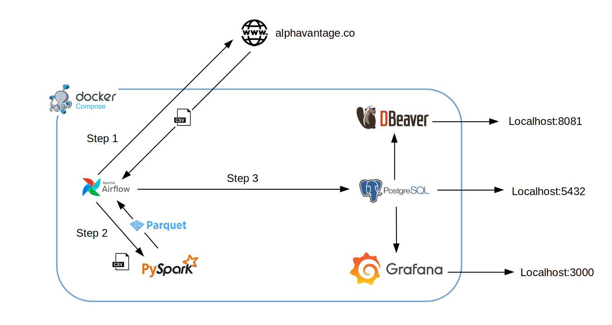
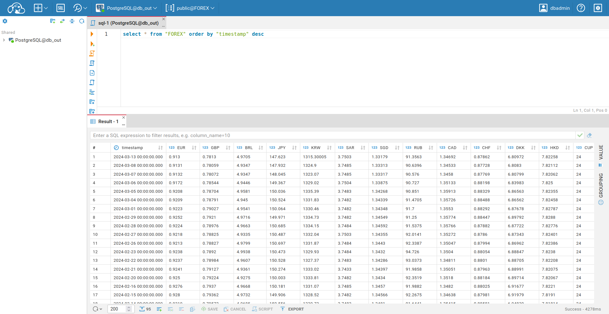
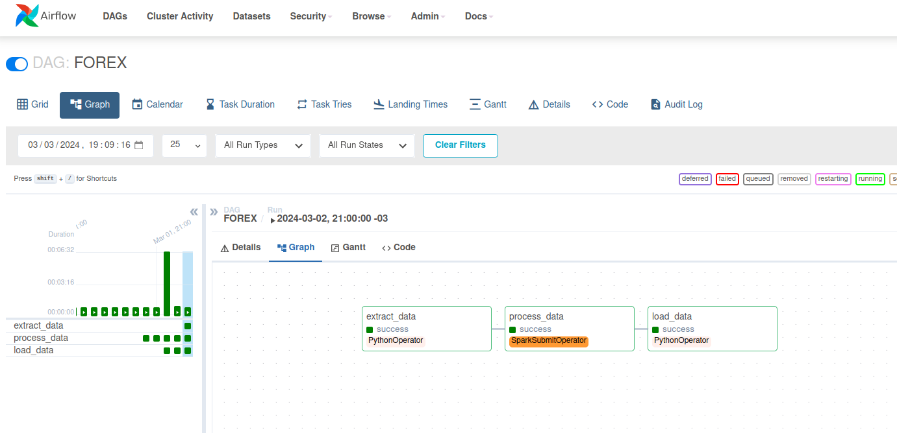

# forex_pipeline


### Visão geral


Fornece uma tabela com a cotação de fechamento de até 25 moedas, de forma *gratuita* e *contínua*.

Os dados brutos são obtidos através da API [AlphaVantage](https://www.alphavantage.co/). Após o processamento dos dados, 
[DBeaver](https://dbeaver.io/download/) permite visualizar e gerenciar os dados presentes no banco de dados destino. Este projeto 
conta igualmente com um dashboard na ferramenta [Grafana](https://grafana.com/), a qual exibe as séries temporais das variações 
de cada moeda (veja a seção [Screenshots](#Screenshots)).

De segunda a sexta, a DAG "FOREX" é disparada no Airflow, a qual executa as seguintes tarefas:

1. Realiza download de todos arquivos .csv (um para cada moeda), os quais contém as últimas cotações para cada moeda abrangida neste projeto
1. Através do PySpark, limpa os dados de cada .csv, removendo colunas irrelevantes, filtrando dados e unindo todos num único dataframe.
Ao final do processamento, salva o dataframe no formato _parquet_
1. Lê o _parquet_, resultado da etapa anterior, e envia os dados para o postgres destino ("db_out")

Uma vez que o mercado de câmbio funciona apenas em dias úteis, a DAG é configurada para não ser disparada em finais de semana.
Adicionalmente, todas etapas contém verificações de forma a evitar duplicação de dados.


### Arquitetura



Como observado na figura acima, o projeto é construído a partir do Docker-Compose. Portanto, trata-se de diversos serviços
distribuídos na mesma rede Docker. Os serviços principais são os seguintes:

- Airflow: orquestra fluxo de trabalho
- PySpark: transforma os dados obtidos da API
- PostgreSQL: banco de dados contendo o resultado final do processamento
- DBeaver: gerenciador de banco de dados, permite visualizar e manipular a tabela-resultado
- Grafana: visualizador de dados. Consome os dados do postgres para gerar gráficos de séries temporais


### Moedas suportadas

É possível adicionar e remover as moedas processadas livremente. É possível processar até 25 moedas de uma só vez (na  
versão gratuita da API). Entretando, se o usuário dispor de uma chave Premium da API, a quantidade passa a ser ilimitada.

As moedas suportadas pela API encontram-se em [currency_list](https://www.alphavantage.co/physical_currency_list/). Para alterar as moedas
processadas, basta modificar os seguintes arquivos:

1. Modificar a lista "coin_codes", presente no arquivo "mnt/airflow/dags/scripts/consts.py"
1. Modificar o arquivo "dump.sql", presente no arquivo "docker/db_out/dump.sql"


### Run

Antes de rodar, é necessário ter o Docker e Docker Compose instalados.

*Importante*: A API funciona a partir de uma chave (por sua vez gratuita). É importante adquirir a mesma no site da 
[API](https://www.alphavantage.co/support/#api-key), e inseri-la na variável "api_key", presente no arquivo 
"mnt/airflow/dags/scripts/consts.py". Este projeto contém uma chave gratuita, mas não há garantia que a mesma ainda seja válida.

1. Clone o repositório:

  ```bash
  git clone https://github.com/trbenfica/forex_pipeline.git
  ```

2. Navegue até o diretório clonado:

  ```bash
  cd forex_pipeline
  ```

3. Execute o seguinte comando:

  ```bash
  docker compose up
  ```

4. Acesse o Airflow e inicie a DAG "FOREX"

Para acessar os serviços:

- Airflow:

  - endereço: localhost:8080
  - login: airflow
  - senha: airflow

- Grafana:

  - endereço: localhost:8081
  - login: admin
  - senha: admin

- DBeaver:

  Para configurar este serviço, é necessário entrar em "localhost:3000", e configurar
  uma conexão com o banco de dados com as seguintes informações:

  - driver: postgres
  - host: db_out
  - port: 5432
  - username: postgres
  - password: postgres
  - database: FOREX


### Screenshots






